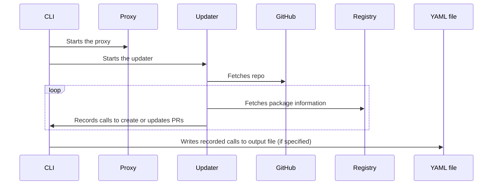

<h1 align="center">
    <picture>
        <source media="(prefers-color-scheme: light)" srcset="https://user-images.githubusercontent.com/7659/174594540-5e29e523-396a-465b-9a6e-6cab5b15a568.svg">
        <source media="(prefers-color-scheme: dark)" srcset="https://user-images.githubusercontent.com/7659/174594559-0b3ddaa7-e75b-4f10-9dee-b51431a9fd4c.svg">
        
    </picture>
</h1>

The `dependabot` CLI is a tool for testing and debugging Dependabot update jobs.

## Installation

Use any of the following for a pain-free installation:

* If you have [`go`](https://go.dev/doc/install) installed, you can run:
   ```shell
   go install github.com/dependabot/cli/cmd/dependabot@latest
   ```
   The benefit of this method is that re-running the command will always update to the latest version.
* You can download a pre-built binary from the [releases] page.
* If you have the [`gh`][gh] command available, you can install the latest release
   of `dependabot` using the following command ([gist source](https://gist.github.com/mattt/e09e1ecd76d5573e0517a7622009f06f)):
   ```shell
   gh gist view --raw e09e1ecd76d5573e0517a7622009f06f | bash
   ```

## Requirements

* [Docker]

## Contributing

Check out our [contributing guidelines][contributing] for instructions on
building the project locally, sharing feedback, and submitting pull requests.

## Usage

```console
$ dependabot
Run Dependabot jobs from the command line.

Usage:
  dependabot [command]

Examples:
  $ dependabot update go_modules rsc/quote
  $ dependabot test -f input.yml

Available Commands:
  completion  Generate the autocompletion script for the specified shell
  help        Help about any command
  test        Test scenarios
  update      Perform an update job

Flags:
  -h, --help                   help for dependabot
      --proxy-image string     container image to use for the proxy (default "ghcr.io/github/dependabot-update-job-proxy/dependabot-update-job-proxy:latest")
      --updater-image string   container image to use for the updater
  -v, --version                version for dependabot

Use "dependabot [command] --help" for more information about a command.
```

### `dependabot update`

Run the `update` subcommand to run a Dependabot update job for the provided ecosystem and repo.
This does not create PRs, but outputs data that could be used to create PRs.

```console
$ dependabot update go_modules rsc/quote
# ...
+----------------------------------------------------+
|        Changes to Dependabot Pull Requests         |
+---------+------------------------------------------+
| created | rsc.io/quote/v3 ( from 3.0.0 to 3.1.0 )  |
| created | rsc.io/sampler ( from 1.3.0 to 1.99.99 ) |
+---------+------------------------------------------+
```

The first argument specifies the _package manager_
(e.g. `go_modules`, `bundler`, `npm_and_yarn`, or `pip`).
Available values are defined in [`dependabot-core`](https://github.com/dependabot/dependabot-core/blob/main/common/lib/dependabot/config/file.rb);
by convention, each ecosystem registers itself according to
[the name of its top-level subdirectory][dependabot-omnibus] in the repo.

The second argument is the _repository_ name with owner
(e.g. `dependabot/cli` for this repo).

By default, repositories are fetched from GitHub.com.
To override this, set the `--provider` / `-p` option to
`azure`, `bitbucket`, `codecommit`, or `gitlab`.

To update dependencies in a subdirectory,
specify a path with the `--directory` / `-d` option.

Set the `LOCAL_GITHUB_ACCESS_TOKEN` environment variable
to a [Personal Access Token (PAT)][PAT],
and the CLI will pass that token to the proxy
to authenticate API requests to GitHub
(for example, to access private repositories or packages).

### Job description file

The command-line interface for the `update` subcommand
provides only a subset of the available options for a Dependabot update job.
To perform security updates or authenticate against a private registry,
you can pass a job description to the `update` subcommand
using the `--file` / `-f` option
(this replaces the package manager and repository name arguments).

```console
dependabot update -f job.yaml
```

```yaml
# job.yaml
job:
    package-manager: npm_and_yarn
    allowed-updates:
      - update-type: all
    security-advisories:
      - dependency-name: express
        affected-versions:
          - <5.0.0
        patched-versions: []
        unaffected-versions: []
    security-updates-only: true
    source:
        provider: github
        repo: dependabot/smoke-tests
        directory: /
        commit: 66115359e6f6cc3af6a661c5d5ae803720b98cb8
credentials:
  - type: npm_registry
    registry: https://npm.pkg.github.com
    token: $LOCAL_GITHUB_ACCESS_TOKEN
```

This example describes an update job
responsive to a hypothetical security advisory affecting
`express` package releases earlier than version `5.0.0`.
When performing this job,
Dependabot will consult the private registry specified
using the provided credentials
instead of the default NPM registry.

Before running an update job,
the `dependabot` CLI replaces any `$`-prefixed values in the YAML file
with values from the environment.
(e.g. `$LOCAL_GITHUB_ACCESS_TOKEN`).

> **Note**
>
> The job description file format isn't documented publicly,
> but you can find examples in the [`testdata` directory](testdata/)
> and check out [the `Job` class in `dependabot-core`][dependabot-updater-job].

### How it works

When you run the `update` subcommand,
the CLI does the following:

1. Pulls the [updater] and [proxy] images from the container registry
2. Creates and configures [container networks]
   so the updater communicates exclusively through the proxy
3. Starts the proxy
4. Starts the updater, using the job description as input
5. Records calls made by the updater to create and manage pull requests
6. Writes recorded calls as YAML (if `--output` / `-o` option is specified)



All network requests made by the updater go through the proxy.
The proxy injects credentials into outbound requests
so that the updater doesn't have access to secrets.
This isolation is especially important for
package managers that run untrusted code during an update job,
such as when evaluating manifest files or executing install scripts.

### `dependabot test`

Run the `test` subcommand
with a scenario file specified by the `--file` / `-f` option
to test the expected behavior for a Dependabot update job.

```console
$ dependabot test -f scenario.yaml
# ...
+------------------------------------------+
|   Changes to Dependabot Pull Requests    |
+---------+--------------------------------+
| created | ubuntu ( from 17.04 to 22.04 ) |
+---------+--------------------------------+

time="2022-09-28T08:15:26Z" level=info msg="15/15 calls cached (100%)"
```

<a href="scenario-file"></a>

### Scenario file

A scenario file describes the input and expected output of a Dependabot job.

```yaml
# scenario.yaml
input:
    job:
        package-manager: docker
        allowed-updates:
          - update-type: all
        ignore-conditions:
          - dependency-name: ubuntu
            source: tests/smoke-docker.yaml
            version-requirement: '>22.04'
        source:
            provider: github
            repo: dependabot/smoke-tests
            directory: /
            commit: 832e37c1a7a4ef89feb9dc7cfa06f62205191994
output:
  - type: create_pull_request
    expect:
        data:
            base-commit-sha: 832e37c1a7a4ef89feb9dc7cfa06f62205191994
            dependencies:
              - name: ubuntu
                previous-requirements:
                  - file: Dockerfile
                    groups: []
                    requirement: null
                    source:
                        tag: "17.04"
                previous-version: "17.04"
                requirements:
                  - file: Dockerfile
                    groups: []
                    requirement: null
                    source:
                        tag: "22.04"
                version: "22.04"
```

This example scenario describes the expected behavior for Dependabot
to update the base image of a Dockerfile from `ubuntu:17.04` to `ubuntu:22.04`.

* The `input` field consists of a `job` and any `credentials`.
  (this is equivalent a [job description file](#job-description-file)).
* The `output` field comprises an array of expectation objects.
  These correspond to requests made by the updater to the Dependabot API service
  when performing an update job.

> **Note**
>
> The scenario file format isn't documented publicly,
> but you can find examples in the [`smoke-tests` repo][smoke-tests]
> and check [the `Job` class in `dependabot-core`][dependabot-updater-job].

### Producing a test

To produce a scenario file that tests Dependabot behavior for a given repo,
run the `update` subcommand and set the `--output` / `-o` option to a file path.

```console
dependabot update go_modules rsc/quote -o go-scenario.yml
```

Run the `test` subcommand for the generated scenario file,
specifying a cache directory with the `--cache` option.

```console
dependabot test -f go-scenario.yml --cache ./tmp/cache
```

While performing the update job,
the CLI writes cached responses to requests in the specified directory.

Run the above command a second time,
and you should see a line that looks like this at the bottom of the output:

> time="2022-09-28T08:14:01Z" level=info msg="117/117 calls cached (100%)"

When the cache coverage for a scenario is 100%,
subsequent runs of the `test` subcommand
are most likely to be fast and deterministic.
Any cache misses indicate an external request made by the updater,
which may cause tests to fail unexpectedly
(for example, when a new version of a package is released).

## Debugging with the CLI

See the [debugging doc](/docs/debugging.md) for details.


## Troubleshooting

### "Docker daemon not running"

```
failed to pull ghcr.io/github/dependabot-update-job-proxy/dependabot-update-job-proxy:latest:
Error response from daemon: dial unix docker.raw.sock: connect: no such file or directory
```

The CLI requires Docker to be running on your machine.
Follow the instructions on [Docker's website][Docker]
to get the latest version of Docker installed and running.

You can verify that Docker is running locally with the following command:

```console
docker --version
```

### "Network internet is ambiguous"

```
failed to start container: Error response from daemon: network internet is ambiguous (2 matches found on name)
```

This error can occur when the CLI exits before having an opportunity to clean up
(e.g. terminating with <kbd>^</kbd><kbd>C</kbd>).
Run the following command to remove all unused networks:

```console
docker network prune
```

### "POST http://host.docker.internal:(port)/update_jobs/cli/update_dependency_list: No response from server"

When locally running the CLI, if you do not set the `--api-url` argument, the default is
to connect to `host.docker.internal` which is effectively a "loopback" endpoint that just
logs the commands set to it. The default IP address used for sending these requests is
`0.0.0.0` which normally works in Linux.

However, when running under WSL2, for some (currently unknown) reason, the `0.0.0.0` default
setting does not work. The workaround is to add this to your CLI environment:

`export FAKE_API_HOST=127.0.0.1`

This allows the requests to go through on WSL2.

Security-wise, it would actually be better if *this* was the default. For more background on
the issue, see <https://github.com/dependabot/cli/issues/113#issuecomment-1610129508>

[Docker]: https://docs.docker.com/get-started/
[contributing]: ./.github/CONTRIBUTING.md
[updater]: https://github.com/dependabot/dependabot-core/pkgs/container/dependabot-updater
[proxy]: https://github.com/github/dependabot-update-job-proxy/pkgs/container/dependabot-update-job-proxy%2Fdependabot-update-job-proxy
[gh]: https://github.com/cli/cli
[releases]: https://github.com/dependabot/cli/releases
[dependabot-core]: https://github.com/dependabot/dependabot-core
[dependabot-omnibus]: https://github.com/dependabot/dependabot-core/blob/main/omnibus/lib/dependabot/omnibus.rb
[container networks]: https://docs.docker.com/config/containers/container-networking/
[smoke-tests]: https://github.com/dependabot/smoke-tests/tree/main/tests
[dependabot-updater-job]: https://github.com/dependabot/dependabot-core/blob/main/updater/lib/dependabot/job.rb
[PAT]: https://docs.github.com/en/authentication/keeping-your-account-and-data-secure/creating-a-personal-access-token
