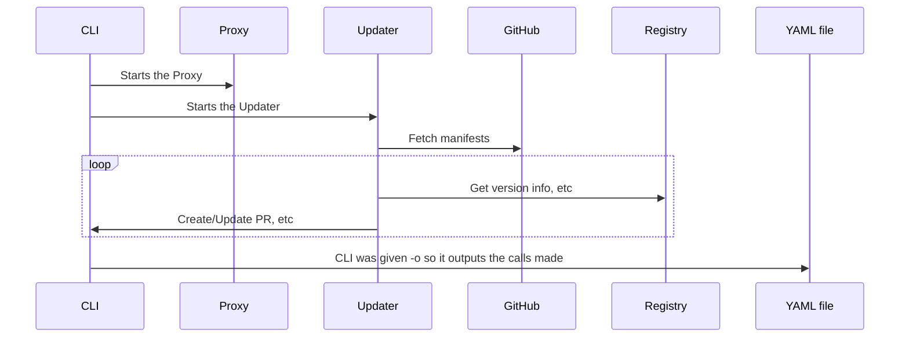
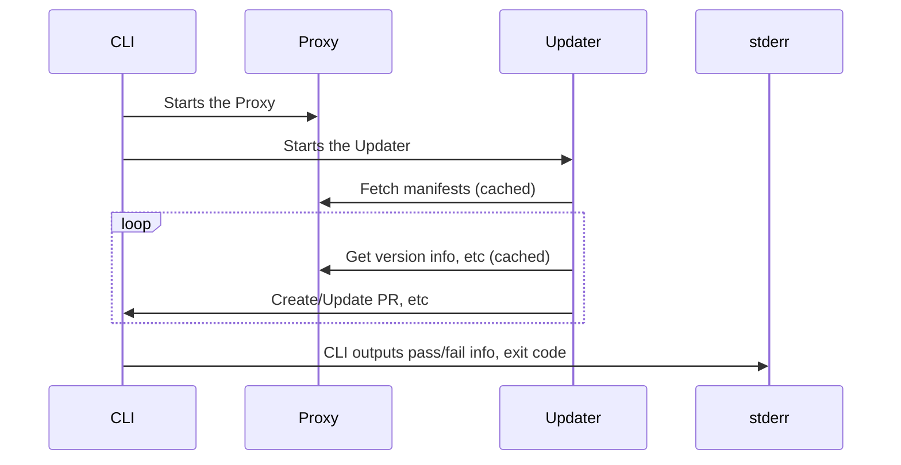
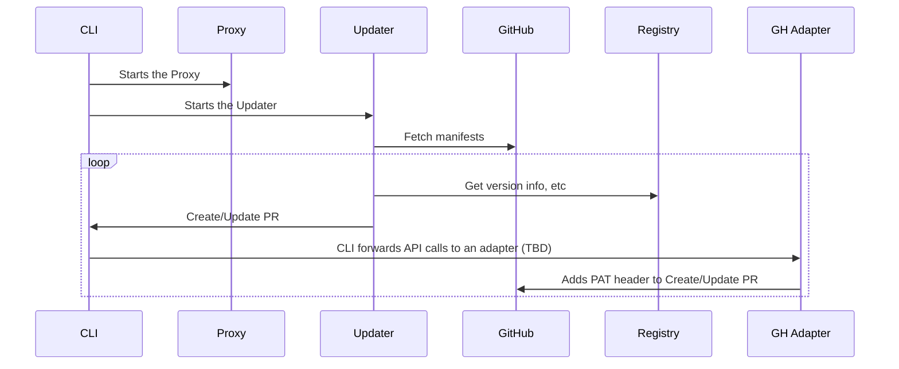
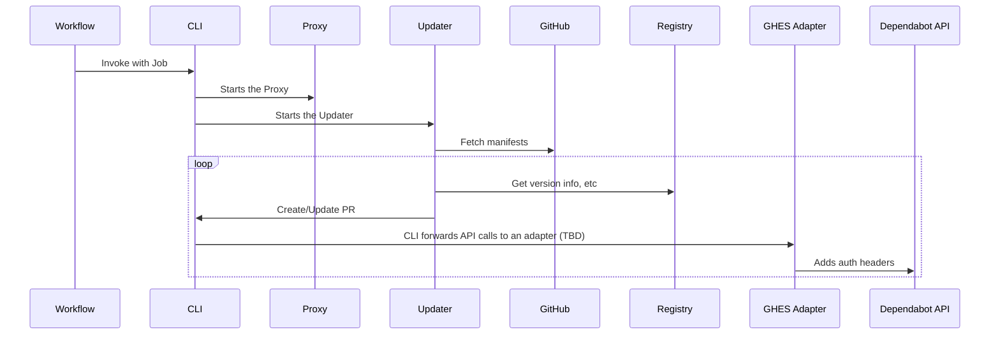

# Design

The CLI is designed to start minimal Dependabot infrastructure on your machine in order to run an update.

At a high level, the CLI:
- Pulls an Updater image and a Proxy image
- Creates networks so the Updater can make calls only through the Proxy 
- Writes the Proxy input file 
- Starts the Proxy
- Writes the job file, which is the input to the Updater
- Starts the Updater image
- Records calls for creating pull requests from the Updater
- Waits for the Updater image to finish
- Cleans everything up

This setup is identical to how [dependabot-action](https://github.com/github/dependabot-action) works, and pretty similar to how our production setup works. So by running with the CLI, we can test essentially what is in production.

## CLI Goals

- Create one way to run Dependabot
  - Makes it easier to test End-to-End
  - Reduce the amount of code the team supports
- Customers can build custom logic downstream from Dependabot CLI by creating adapters
- External users who integrate with other systems can create adapters too

The CLI also opens a lot of doors around extensibility and maintainability of ecosystems.

## Sequence Diagrams

All Updater calls go through the Proxy, I've elided those for brevity.

### E2E tests

Generating tests with a --dry-run:

Asserting expected behavior, fully cached in the Proxy:

### On Desktop

Future phase

### In GHES

Future phase

