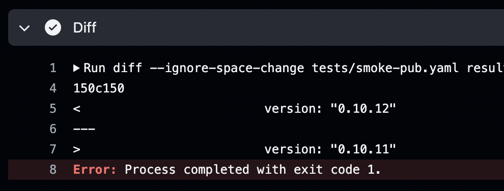

# End-to-End tests

The Dependabot CLI includes features to produce and run end-to-end (e2e) tests.

## Producing a test

- Create a repository with the manifest and files you want to test on GitHub
- Generate the test file by doing a dry-run
  - For example: `dependabot update bundler dependabot/e2e-tests -o=testdata/smoke-bundler.yaml --dry-run`
- Test the cache effectiveness by running the `test` command twice with the cache option. Make sure you start with a clean cache initially.
  - `dependabot test -f=testdata/smoke-bundler.yaml --cache=tmp/cache`
  - At the end of the test you'll see an output like this: `time="2022-08-11T00:34:41Z" level=info msg="71/316 calls cached (22%)"`
  - If the cache coverage isn't 100% the test will most likely fail when a new dependency is published
- If you are producing a new smoke test:
  - Add entries in the workflows:
    - cache-all.yml
    - cache-one.yml
    - smoke.yml
  - Put up the PR
  - Run the cache-one workflow on the new ecosystem to fill the cache
  - Run the smoke workflow to verify tests are passing, and cache coverage is good
  - You may also need to update the smoke workflow in updater or core

## Debugging a failure

When an e2e test fails in a workflow, it produces a diff between the test expectations and the actual output:

Use this information to decide if the test failure is just the ecosystem somehow evading caching, or if it's a real failure.

To test locally:
- Optionally download the exiting cache with, for example `cd tmp/cache && gh run download --repo dependabot/cli --name cache-bundler`
- Run the test: `dependabot test -f=testdata/smoke-bundler.yaml -cache=tmp/cache`
  - Overwrite the existing test for easy diffing with git: `dependabot test -f=testdata/smoke-bundler.yaml -o=testdata/smoke-bundler.yaml -cache=tmp/cache`

## Working with the Actions cache

The caching in Actions is handled by build artifacts. Each cache has a unique name, like `cache-bundler`. 

To create a new cache, run the `cache-one` workflow. 

To create all new caches, run `cache-all`. It's rare to do this, and takes a long time, so recommended you stick to `cache-one`.

To download them for local testing, run `gh run download --repo dependabot/cli --name cache-bundler`.
